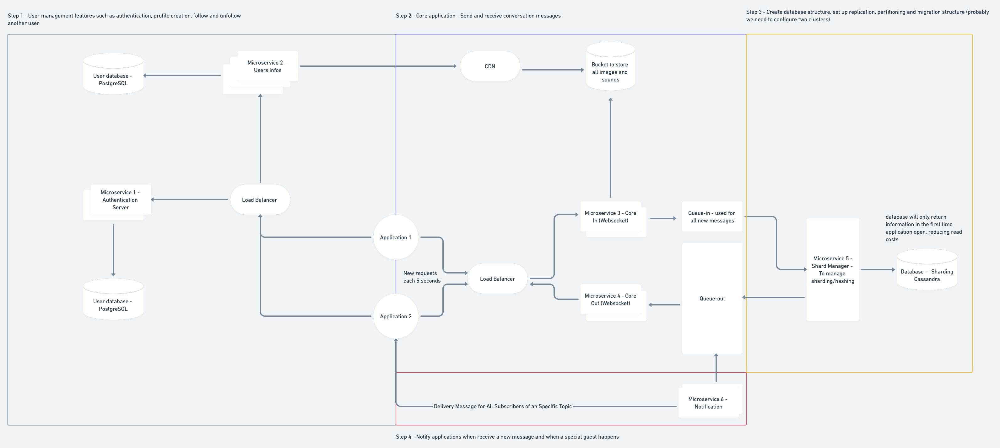

# hiddn-loadbalancer-default
The Hiddn project consists of a platform where users can connect with each other and chat anonymously in order to find out who and who.  

The great advantage of the platform is that each conversation lasts 24 hours and after that they are destroyed forever.

This project is being developed as an diploma thesis for the Web and Mobile App Development course at Cornerstone Community College of Canada - Vancouver, BC.

The software architecture developed was designed to scale and support massive amounts of data for millions of simultaneous users:

All repositories related to the project follow the same name pattern starting with: hiddn-

